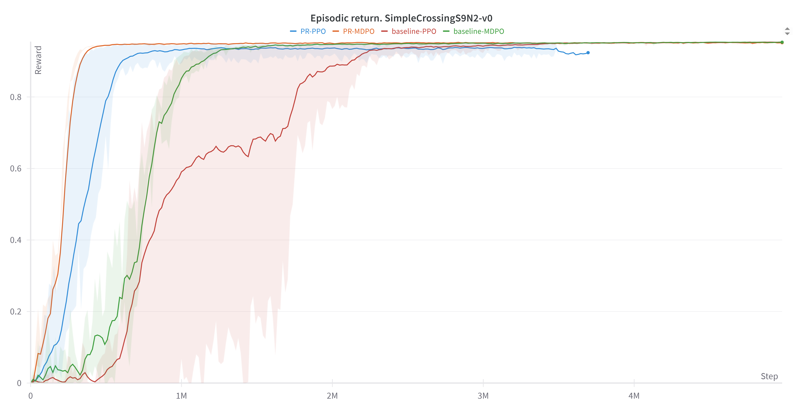
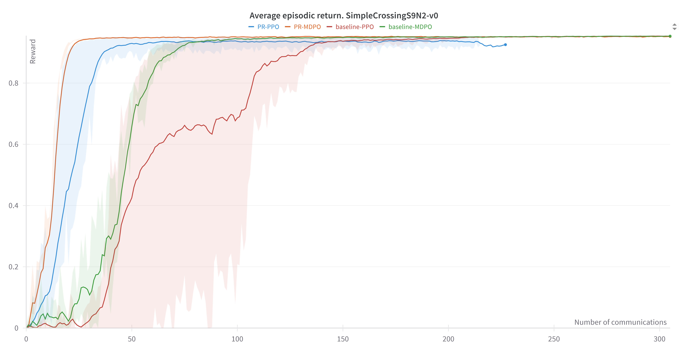
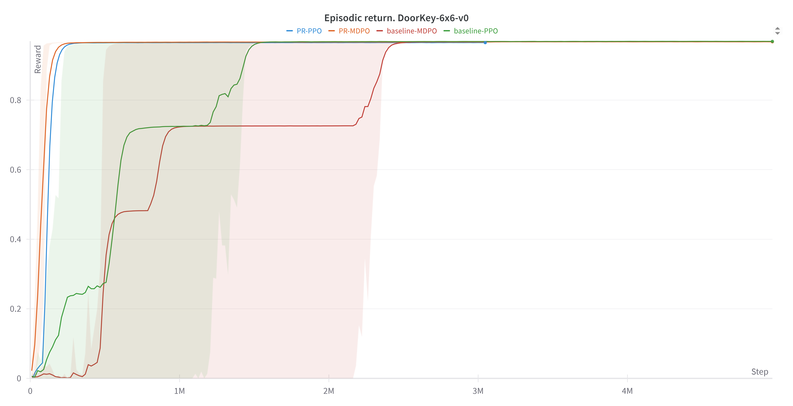
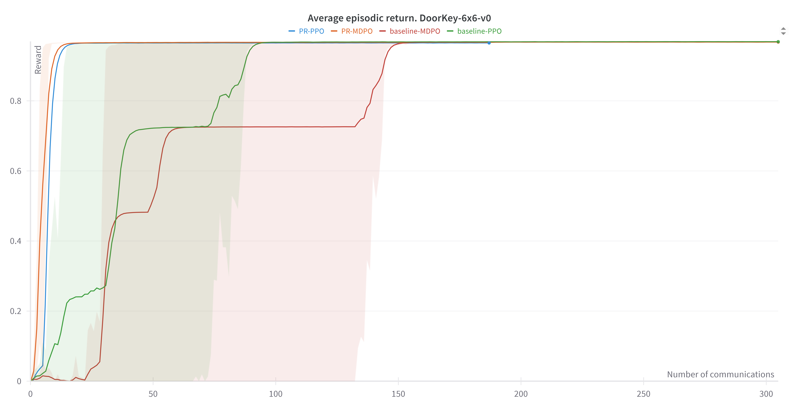
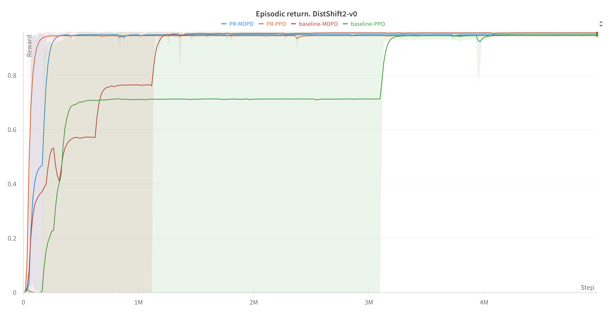
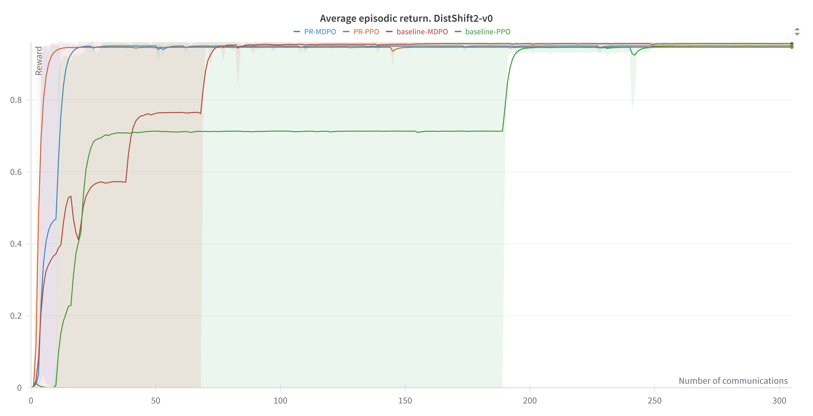
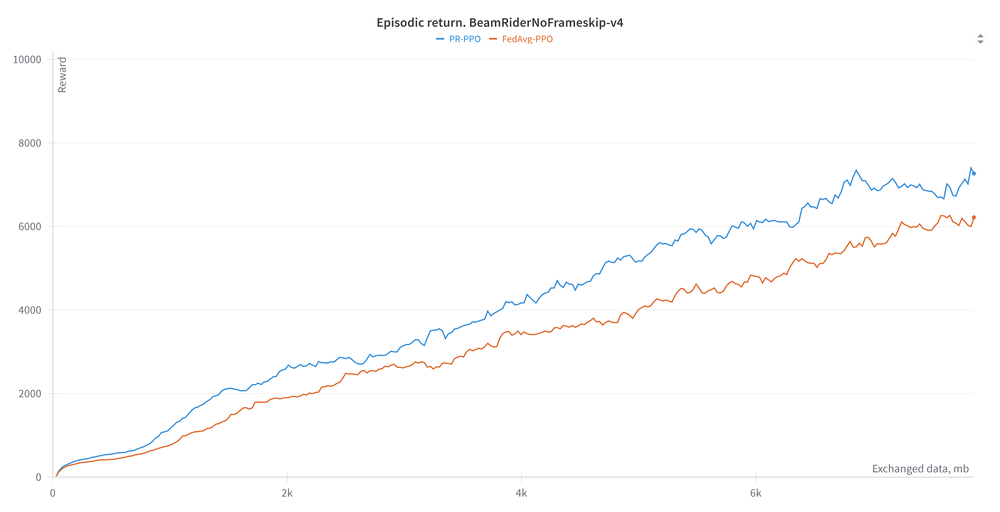

Мы провели серию экспериментов в дискретных средах Minigrid и Atari, которые подтверждают генерализуемость предложенного нами алгоритма PR-PPO. Результаты показали, что коллаборативный подход в обучении систем, состоящих из нескольких агентов, позволяет ускорять процесс обучения агентов в отдельной среде и, более того, выходить на более высокий reward. Мы также показали, что предложенный нами подход PR-PPO коллаборативного обучения агентов позволяет им учиться быстрее и выходить на более высокий reward по сравнению с алгоритмом FedAvg, суть которого заключается в том, что веса агентов усредняются во время глобальных коммуникаций. Более того, помимо уже ставшего классикой алгоритма обновления политик PPO мы также провели эксперименты по обучению агентов с использованием алгоритма MDPO, как в коллаборативном сетапе PR-MDPO, так и в изолированном, когда агент обучается в одиночку без коммуникаций.
## 1. Описание экспериментов
Ключевыми гиперпараметрами в обучении агентов являются следующие:
-	общее число шагов, которые сделает агент в среде (total_timesteps)
-	шаг обучения (learning_rate)

    **Note.** Этот шаг anneal'ится

-	коэффициент перед KL-термом в objective-лоссе PPO и MDPO (penalty_coeff)
-	дисконтирующий фактор (gamma)
-	the lambda for the general advantage estimation (gae_lambda)
-	коэффициент перед value function (vf_coef)
-	коэффициент перед слагаемым энтропии (ent_coef)
-	число параллельных сред, в которых каждый агент обучается (num_envs)
-	число шагов, которые агент проделывает в каждой из своих сред для получения policy rollout (num_steps)

    **Note 1.** Размер батча для обновления политики равен batch_size = num_steps * num_envs

    **Note 2.** Общее число таких обновлений равно num_updates = total_timesteps // batch_size

-	число коммуницирующих агентов (n_agents)

    **Note.** n_agents=1 означает изолированный сетап, n_agents>1 – коллаборативный

-	число локальных эпох между глобальными коммуникациями (local_updates)
-	коэффициент перед KL-термом в objective-лоссе PR-PPO и PR-MDPO (comm_penalty_coeff)

Мы произвели сотни запусков с перебором следующих гиперпараметров: total_timesteps, learning_rate,  penalty_coeff, vf_coef, ent_coef, num_envs, num_steps, n_agents, local_updates, comm_penalty_coeff. Для сравнения различных алгоритмов обучения агентов мы выбрали наиболее успешные конфигурации запусков как в коллаборативном, так и в изолированном подходе и усреднили их по нескольким сидам.

В коллаборативных сетапах ниже рассматриваются системы из трёх агентов. Веса в матрице коммуникаций в предложенных нами алгоритмах PR-PPO и PR-MDPO обновляются во время очередной глобальной коммуникации пропорционально среднему реворду отдельного агента с момента последней глобальной коммуникации.

## 2. Результаты экспериментов

### 2.1. Minigrid

#### 2.1.1.	FourRooms-v0

<table>
<tr>
<td></td>
<td></td>
</tr>
</table>

#### 2.1.2.	SimpleCrossingS9N2-v0

<table>
<tr>
<td></td>
<td></td>
</tr>
</table>

#### 2.1.3.	DoorKey-6x6-v0

<table>
<tr>
<td></td>
<td></td>
</tr>
</table>

#### 2.1.4.	DistShift2-v0

<table>
<tr>
<td></td>
<td></td>
</tr>
</table>

#### 2.1.5.	Выводы

Результаты экспериментов в средах Minigrid показали, что алгоритмы PR-PPO и PR-MDPO коллаборативного обучения агентов позволяют им учиться значительно быстрее. Более того, в одних средах алгоритмы на основе MDPO показывают себя лучше, чем PPO, а в каких-то – наоборот. Обучение агентов в коллаборативном сетапе получается более стабильным с меньшей дисперсией, если сравнивать с обучением изолированных агентов (бейзлайнов).

### 2.2. Atari

#### 2.2.1.	BeamRiderNoFrameskip-v4

<table>
<tr>
<td></td>
<td></td>
</tr>
</table>

#### 2.2.2.	AsterixNoFrameskip-v4

<table>
<tr>
<td></td>
<td></td>
</tr>
</table>

#### 2.2.3.	Выводы

Результаты экспериментов в средах Atari показали, что алгоритм PR-PPO позволяет агентам выходить на более высокий reward с меньшими затратами в коммуникациях по сравнению с алгоритмом FedAvg, то есть с использованием алгоритма PR-PPO необходимо меньшее число коммуникаций и как следствие меньший объём переданной информации для достижения лучшего результата.